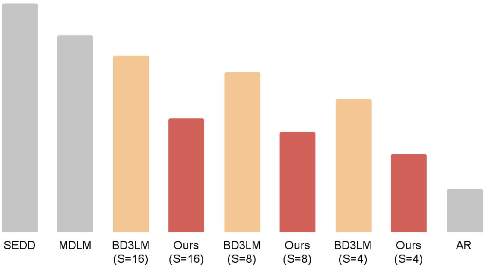

# Entropy-Adaptive Block Diffusion for Language Models (DL4NLP Project)

We introduce EBD3, an **E**ntropy-based **B**lock **D**iscrete **D**enoising **D**iffusion framework for language models. EBD3 achieves state-of-the-art likelihood among diffusion-based models while supporting generation of arbitrary-length sequences. Built on BD3LM, which unifies autoregressive and diffusion modeling, EBD3 incorporates an adaptive entropy-based selection strategy at test time to reduce diffusion uncertainty and lower perplexity. This enables block-wise conditional generation and context-aware refinement of past tokens, capabilities beyond standard autoregressive approaches.


## Results on OpenWebText
| Block Size | BPD | NLL | PPL | log |
|------------|---------|---------|---------|-------|
| 4          | 4.231   | 2.933   | 18.778  | [log](res/bd3lm_owt_block_size4_entropy4.0_stopfalse_all.log) |
| 8          | 4.290   | 2.973   | 19.559  | [log](res/bd3lm_owt_block_size8_entropy4.0_stopfalse_all.log) |
| 16         | 4.324   | 2.997   | 20.033  | [log](res/bd3lm_owt_block_size16_entropy4.0_stopfalse_all.log) |



<a name="code-organization"></a>
## Code Organization
1. ```main.py```: Routines for training and evaluation
2. ```noise_schedule.py```: Noise schedules
3. ```diffusion.py```: Forward/reverse diffusion
4. ```dataloader.py```: Dataloaders
5. ```utils.py```: LR scheduler, logging, `fsspec` handling
6. ```models/```: Network architectures. Supports [DiT](https://arxiv.org/abs/2212.09748) and AR transformer
7. ```configs/```: Config files for datasets/models/noise schedules/LR schedules
8. ```scripts/```: Shell scripts for training/evaluation
    - ``train/``: Training scripts (LM1B, OWT)
    - ``ppl/``: Likelihood evaluation on the pretraining set (LM1B, OWT)
    - ``zs_ppl/``: Zero-shot likelihood evaluation on GPT2 benchmark datasets
    - ``gen_ppl/``: Sample quality (generative perplexity under GPT2)
    - ``var_len/``: Arbitrary-length sequence generation
9. ```ssd-lm/```: SSD-LM codebase
    - ```run_generate_text_batch.sh```: Generates SSD-LM samples
    - ```report_genppl.py```: Reports generative perplexity of SSD-LM samples


<a name="getting_started"></a>

## Getting Started

To get started, create a conda environment containing the required dependencies.

```bash
conda create --name bd3lm python=3.9
conda activate bd3lm
pip install -r requirements.txt
```
While BD3-LMs don't require FlashAttention, evaluating baselines from MDLM require `flash-attn==2.5.6`

Create the following directories to store saved models and slurm logs:
```bash
mkdir outputs watch_folder logs sample_logs
```
and run the training as a batch job:
```bash
sbatch scripts/train/train_owt_bd3lm.sh
```

### Checkpoints

Since our method operates purely at test time, it does not require any additional training or fine-tuning. We therefore evaluate EBD3 using publicly available BD3-LMs trained on OpenWebText, with block sizes of 4, 8, and 16, each trained for 1M steps and released on HuggingFace 🤗: [kuleshov-group/bd3-lms](https://huggingface.co/collections/kuleshov-group/bd3-lms-67be95f81b96b15fec50d53f) BD3-LMs are finetuned from an MDLM checkpoint trained on OpenWebText for 850K gradient updates. The pretraining checkpoint on HuggingFace: [kuleshov-group/bd3lm-owt-block_size1024-pretrain](https://huggingface.co/kuleshov-group/bd3lm-owt-block_size1024-pretrain)

## Reproducing Experiments

Below, we describe the steps required for reproducing the experiments.
Throughout, the main entry point for running experiments is the [`main.py`](./main.py) script.

### Likelihood Evaluation 
To compute test perplexity, use `mode=ppl_eval`. Example scripts are provided in `scripts/ppl/ppl_owt_ebd3.sh`. Here's an example evaluation script on OpenWebText:
```bash
BLOCK_SIZE=4
ENTROPY_THRESHOLD=4.0
USE_ENTROPY_STOP=false

python -u main.py \
    loader.eval_batch_size=16 \
    model=small \
    algo=bd3lm \
    algo.backbone=hf_dit \
    data=openwebtext-split \
    data.insert_valid_special=False \
    model.length=1024 \
    model.attn_backend=flex \
    block_size=${BLOCK_SIZE} \
    eval.checkpoint_path=kuleshov-group/bd3lm-owt-block_size${BLOCK_SIZE} \
    sampling.use_entropy_stop=${USE_ENTROPY_STOP} \
    sampling.entropy_threshold=${ENTROPY_THRESHOLD} \
    sampling.entropy_guided_xt=true \
    wandb=null \
    mode=ppl_eval > $PWD/logs/bd3lm_owt_block_size${BLOCK_SIZE}_entropy${ENTROPY_THRESHOLD}_stop${USE_ENTROPY_STOP}_all.log
```

### Generate Arbitrary-Length Sequences

To generate arbitrary-length sequences, set `mode=sample_eval`. Example scripts are provided in `scripts/var_len/var_len*.sh`. Here's an example script using BD3-LM:
#### HuggingFace model
```bash
BLOCK_SIZE=4 # 4, 8, 16
LENGTH=2048 # arbitrary; needs to be a multiple of the block size

python -u main.py \
    loader.eval_batch_size=1 \
    model=small \
    algo=bd3lm \
    algo.T=5000 \
    algo.backbone=hf_dit \
    data=openwebtext-split \
    model.length=$LENGTH \
    block_size=$BLOCK_SIZE \
    wandb=null \
    mode=sample_eval \
    eval.checkpoint_path=kuleshov-group/bd3lm-owt-block_size${BLOCK_SIZE} \
    model.attn_backend=sdpa \
    sampling.nucleus_p=0.9 \
    sampling.kv_cache=true \
    sampling.logdir=$PWD/sample_logs/samples_genlen_bd3lm_blocksize${BLOCK_SIZE}
```

#### Local checkpoint
```bash
BLOCK_SIZE=4 # 4, 8, 16
LENGTH=2048 # arbitrary; needs to be a multiple of the block size

python -u main.py \
    loader.eval_batch_size=1 \
    model=small \
    algo=bd3lm \
    algo.T=5000 \
    data=openwebtext-split \
    model.length=$LENGTH \
    block_size=$BLOCK_SIZE \
    wandb=null \
    mode=sample_eval \
    eval.checkpoint_path=/path/to/checkpoint/bd3lm-owt-block_size${BLOCK_SIZE} \
    model.attn_backend=sdpa \
    sampling.nucleus_p=0.9 \
    sampling.kv_cache=true \
    sampling.logdir=$PWD/sample_logs/samples_genlen_bd3lm_blocksize${BLOCK_SIZE}
```

### Acknowledgements
This repository was built off of [BD3-LM](https://github.com/kuleshov-group/bd3-lm), [MDLM](https://github.com/kuleshov-group/mdlm) and [SEDD](https://github.com/louaaron/Score-Entropy-Discrete-Diffusion).
